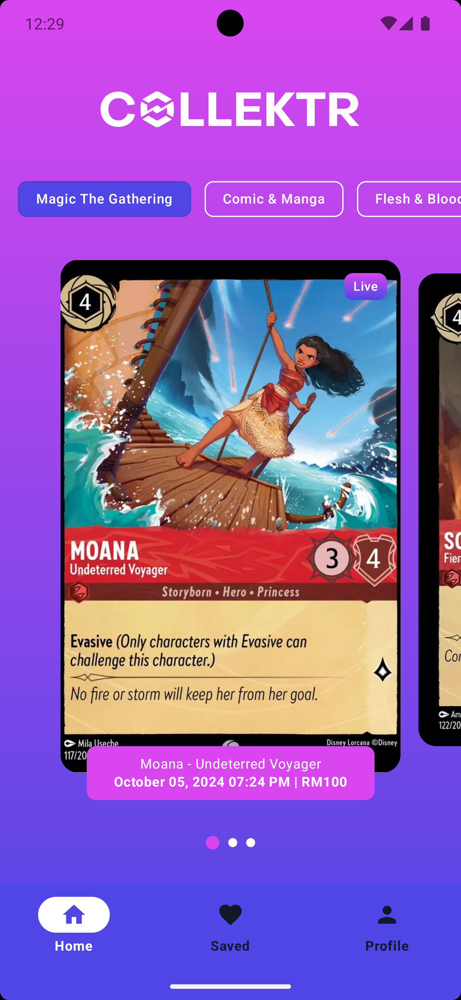
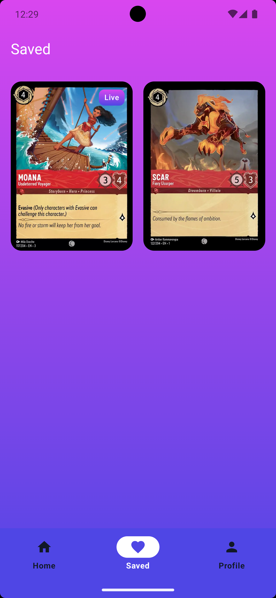
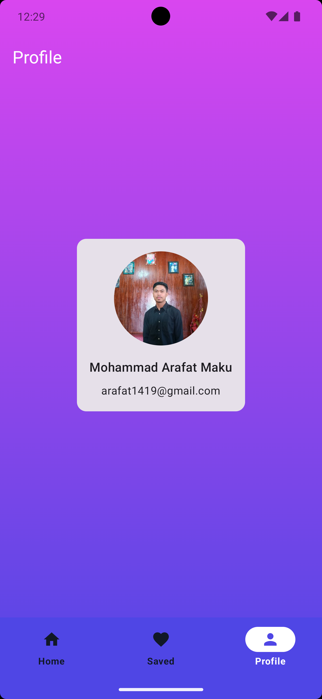
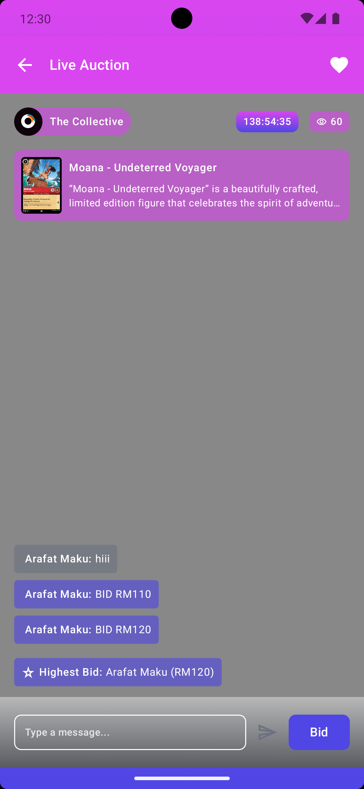
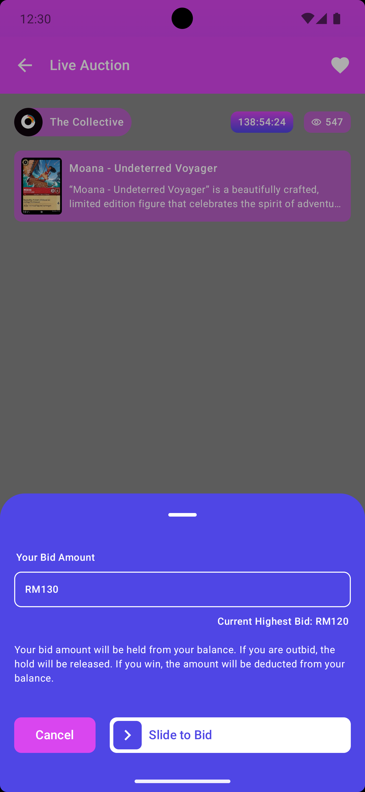
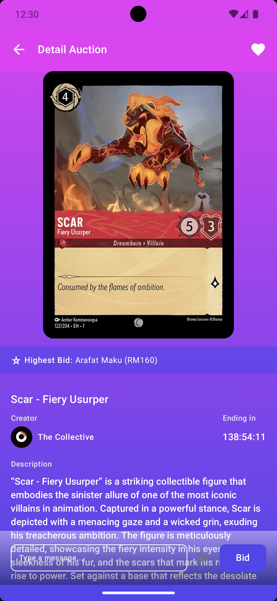
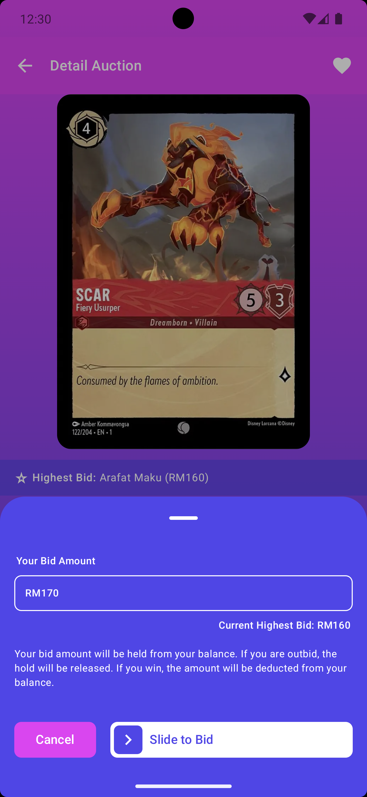

# Collektr - Live Bidding App

 
 
 

* UI 
   * [Compose](https://developer.android.com/jetpack/compose) declarative UI framework
   * [Material design](https://material.io/design)
   * Design Refrence: https://www.figma.com/design/T2T3qKd85pcOjdJ5za52yT/Collekt-Test?node-id=0-1&t=Z2JFLtjo6A5eHJBc-1

* Tech/Tools
    * [Kotlin](https://kotlinlang.org/) 100% coverage
    * [Coroutines](https://kotlinlang.org/docs/reference/coroutines-overview.html) and [Flow](https://developer.android.com/kotlin/flow) for async operations
    * [Hilt](https://developer.android.com/training/dependency-injection/hilt-android) for dependency injection
    * [Jetpack](https://developer.android.com/jetpack)
        * [Compose](https://developer.android.com/jetpack/compose) 
        * [Navigation](https://developer.android.com/topic/libraries/architecture/navigation/) for navigation between composables
        * [ViewModel](https://developer.android.com/topic/libraries/architecture/viewmodel) that stores, exposes and manages UI state
    * [Retrofit](https://square.github.io/retrofit/) for networking
    * [Room](https://square.github.io/retrofit/) for database
    * [Coil](https://github.com/coil-kt/coil) for image loading
    
* Modern Architecture
    * Single activity architecture (with [Navigation component](https://developer.android.com/guide/navigation/navigation-getting-started)) that defines navigation graphs
    * MVVM for presentation layer
    * [Android Architecture components](https://developer.android.com/topic/libraries/architecture) ([ViewModel](https://developer.android.com/topic/libraries/architecture/viewmodel), [Navigation](https://developer.android.com/jetpack/androidx/releases/navigation))
    * [Android KTX](https://developer.android.com/kotlin/ktx) - Jetpack Kotlin extensions
    * Modularization: The project is modular, with the code separated across layers (Presentation, Domain, Data), ensuring ease of maintenance and scalability.
 
## Clean Architecture Overview
Clean Architecture is designed to separate the core logic of the application from the implementation details such as frameworks, UI, and databases. This separation is achieved by organizing code into different layers:
- **Domain Layer**: Contains the business logic, use cases, and entities. This layer is framework-independent, ensuring that the core logic can be reused across different platforms.
- **Data Layer**: Manages data sources like APIs or databases and is responsible for providing the necessary data to the Domain layer. It also defines repositories that abstract away the data retrieval mechanism.
- **Presentation Layer**: Contains UI-related code, such as ViewModels and Composables, and is responsible for rendering data and handling user interaction. In Jetpack Compose, this layer defines the screen states, UI events, and compositions.

## MVVM Architecture
The **Model-View-ViewModel** (MVVM) pattern helps manage the relationship between the UI and the data. Here's how each component interacts:
- **Model**: Represents the data layer and business logic, often encapsulated in repositories.
- **View**: In Jetpack Compose, the view is the composable function that defines the UI components. The view observes the state exposed by the ViewModel and re-composes when the state changes.
- **ViewModel**: The ViewModel serves as a bridge between the View and the Model. It exposes state (e.g., `LiveData` or `State`) and handles UI logic. In Clean Architecture, ViewModels typically interact with use cases from the Domain layer to fetch or manipulate data.

## Hilt for Dependency Injection
This project utilizes **Hilt** for dependency injection. Hilt simplifies the process of managing dependencies in Android by:
- Automatically providing dependencies required by classes like ViewModels.
- Reducing boilerplate code by generating necessary components.
- Making the project easily testable by supporting dependency injection in test cases.

Each layer in the architecture, such as ViewModels, Repositories, and Use Cases, relies on Hilt to inject dependencies, ensuring that the app is highly modular and adheres to the principles of Clean Architecture.

## Structure in this Project
- **Presentation Layer**: Jetpack Compose UI + ViewModels following the MVVM pattern. State management and navigation are handled here, with a focus on keeping the UI responsive to changes in the ViewModel.
- **Domain Layer**: Use cases and business logic are implemented in a framework-independent manner, using interfaces to abstract external details.
- **Data Layer**: Repositories abstract the details of data sources (e.g., REST APIs, local databases), ensuring the Domain layer is not dependent on the specifics of data retrieval.

By adhering to this architecture and using Hilt, the project is:
- **Testable**: Each layer can be independently tested.
- **Maintainable**: With the separation of concerns, each layer evolves independently.
- **Scalable**: Adding new features or refactoring existing code is easier since responsibilities are clearly defined across layers.

## Features
- Splash Screen
- Live Bidding and Chat
- Save Auction
- Countdown Timer

## Challenges Faced
When starting this project, I faced significant doubts, especially regarding the Data Layer. I was confused about how to structure it in a way that would ensure all components functioned as intended and could be effectively used throughout the app.

## Future Enhancements
- **Live Auction Video**: A placeholder is included for live video content, which can be integrated with real streaming APIs.
- **Real-Time Chat**: Currently, the chat UI is only store in local storeage, but this can be extended with real-time chat functionality using a service like Firebase.
- **Countdown Timer**: A countdown timer representing the auction's end time can be implemented to improve user experience.

## How to Run This App
1. Clone the Repository: First, clone the repository to your local machine using Git. Open your terminal and run:
- git clone [<repository-url>](https://github.com/arafat1419/Collektr-Test/)
- cd Collektr-Test
2. Open the Project in Android Studio
- Launch Android Studio
- Click on File > Open… and navigate to the directory where the project was cloned.
- Select the project folder and click OK to open it.
3. Sync Gradle
- Once the project is opened, Android Studio will automatically attempt to sync Gradle. If prompted, allow it to download and sync all dependencies.
4. Build the Project
- Ensure that the project builds successfully by selecting the Build menu from the top bar and choosing Make Project or Rebuild Project. Alternatively, you can use the shortcut Ctrl + F9 (Windows/Linux) or Cmd + F9 (Mac) to build the project.

## APK
- https://drive.google.com/drive/folders/139MOEjhbyPqTBxFwXLGX1wgyVnvWquKj?usp=sharing
